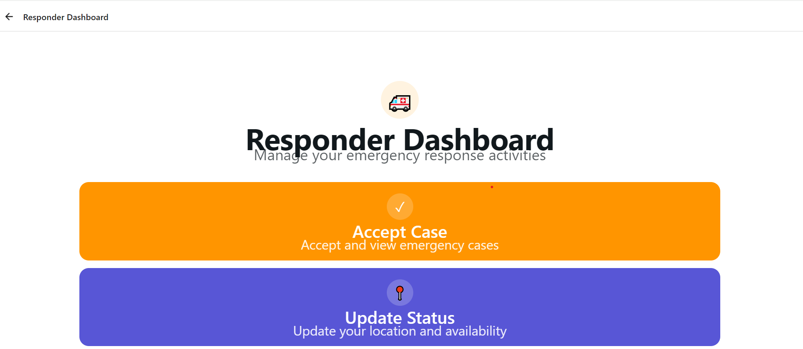
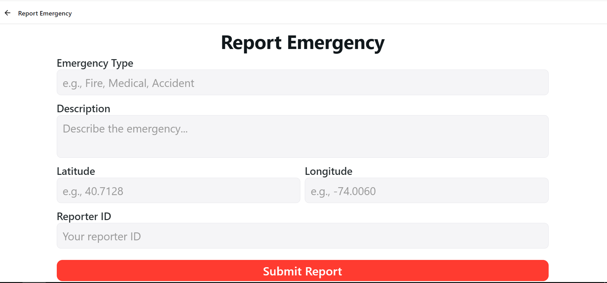
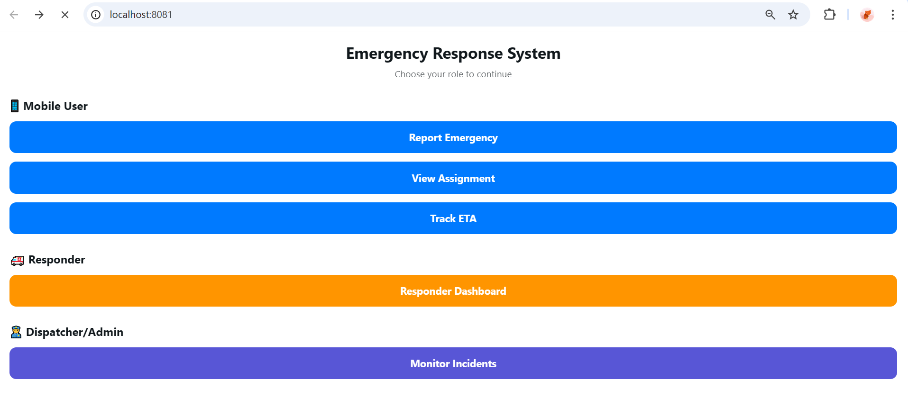

# Emergency Response System - Usage Guide

## Starting the Application

1. Build the project:
   ```bash
   mvn clean install
   ```

2. Run the application:
   ```bash
   mvn spring-boot:run
   ```

The application will start on `http://localhost:8080`

### Frontend
```bash
cd frontend
```

```bash
npm install
```

```bash
npm run web
```

## API Endpoints
API endpoints are detailed in api-spec.yaml

Import [[documentation\Postman_Collection.json]] to postman.

## Notes

- The `reporterId` must be at least 3 characters long
- ETA is calculated based on simple distance calculation (simple implementation)
- The system picks the first available responder for assignment
- All coordinates use decimal degrees (latitude, longitude)

## H2 Console

You can access the H2 database console at:
```
http://localhost:8080/h2-console
```

````markdown
# Emergency Response System - Usage Guide

## Starting the Application

1. Build the project:
   ```bash
   mvn clean install
   ```

2. Run the application:
   ```bash
   mvn spring-boot:run
   ```

The application will start on `http://localhost:8080`

### Frontend
```bash
cd frontend
```

```bash
npm install
```

```bash
npm run web
```

## API Endpoints
API endpoints are detailed in api-spec.yaml

Import [[documentation/Postman_Collection.json]] to postman.

## Notes

- The `reporterId` must be at least 3 characters long
- ETA is calculated based on simple distance calculation (simple implementation)
- The system picks the first available responder for assignment
- All coordinates use decimal degrees (latitude, longitude)

## H2 Console

You can access the H2 database console at:
```
http://localhost:8080/h2-console
```

Connection details:
- JDBC URL: `jdbc:h2:mem:emergencydb`
- Username: `sa`
- Password: (empty)

````

## Screenshots






